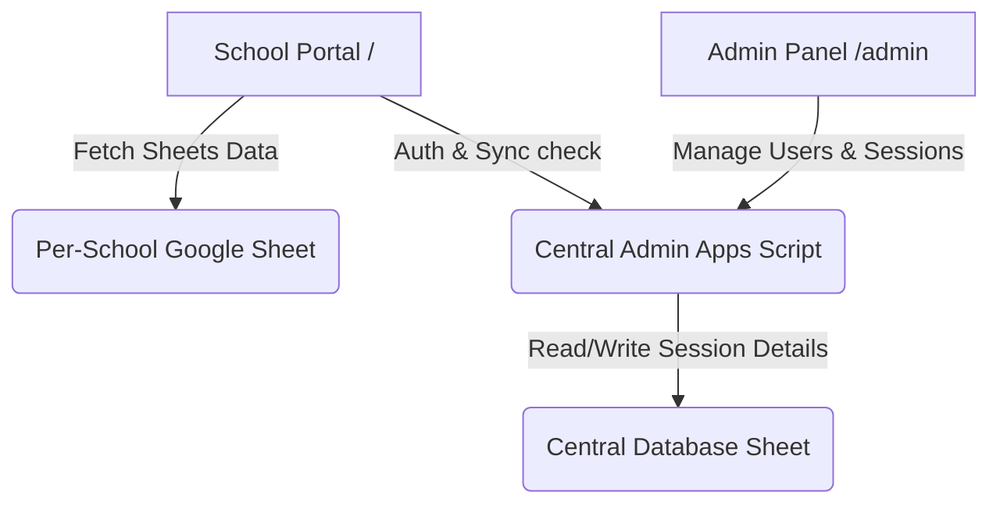

# School Data Portal & Admin Control Panel

A lightweight, high-performance, mobile-first static Progressive Web App (PWA) designed for schools. The system enables school users to access, search, and export student records from dynamic Google Sheets databases, while providing a central Administrator Control Panel to manage credentials, access statuses, editing permissions, and active device sessions.

---

## Table of Contents
1. [System Overview & Architecture](#system-overview--architecture)
2. [Core Features](#core-features)
   - [School Portal (Client/User)](#1-school-portal-clientuser)
   - [Admin Control Panel (Management)](#2-admin-control-panel-management)
3. [Technology Stack](#technology-stack)
4. [File Structure & Directory Layout](#file-structure--directory-layout)
5. [Setup & Deployment Instructions](#setup--deployment-instructions)
   - [A. Per-School Google Sheet & Apps Script Setup](#a-per-school-google-sheet--apps-script-setup)
   - [B. Central Authentication & Control Script](#b-central-authentication--control-script)
   - [C. Local Configuration & Deployment](#c-local-configuration--deployment)
6. [Offline Capabilities & Data Syncing](#offline-capabilities--data-syncing)
7. [Development & Local Running](#development--local-running)

---

## System Overview & Architecture

The project consists of two primary static interfaces that run entirely in the browser:



- **School Portal (Root `/`)**: An analytics dashboard and sheet viewer designed for individual school administrators. Deployed as a Progressive Web App (PWA), it operates seamlessly offline, caching previous student data using `localStorage` and syncing changes back to the cloud.
- **Admin Control Panel (`/admin`)**: A unified, responsive control room for system super-administrators. It connects to a centralized Google Apps Script API endpoint to view all active school portal configurations, modify credentials, adjust read/write permissions, and terminate active device sessions remotely.

---

## Core Features

### 1. School Portal (Client/User)
* **Custom Metric Cards & Analytics**: Renders student counts, gender ratios, category tiles, and class strength overview chips computed dynamically from loaded worksheets.
* **Worksheet Tabs**: Three interactive tabs corresponding to the spreadsheet worksheets: `UDISE`, `3.0`, and `School Data`.
* **Resilient Universal Search**: Offers cross-sheet keyword searching on selectable column intersections.
* **Configure & Export PDFs**: Integrates an overlay modal allowing users to toggle specific columns, customize the column layout order, add custom blank columns, and compile filtered records into a print-ready PDF via `jsPDF`.
* **Automatic Indian Date Formatting**: Detects ISO date values (e.g. `2015-06-15T00:00:00.000Z`) in any cell across tables, details popup, or form pre-fills, and automatically formats them to a human-readable format (`dd/mm/yyyy` using `en-IN` locale) for display, while preserving the raw value for server sync.
* **Background Auto-Refresh**: Includes a 24-hour cache invalidation checker that silently runs a background data sync if client data becomes stale.

### 2. Admin Control Panel (Management)
* **Status Monitoring**: Displays database connection statuses (Connected/Disconnected) and active session lists across all registered schools.
* **School Registry Management**: Allows the super-admin to edit school credentials, suspend/restore school portal access (`active` vs. `inactive`), and toggle editing permissions (`editable` vs. `read-only`) in real time.
* **Remote Session Control**: Lists active school browser sessions, displaying the user ID, device model, browser version, and login timestamp. Supports remote force-logout of individual device sessions.
* **Password Resets**: Includes a secure modal to reset any school password directly from the administrative UI.

---

## Technology Stack

* **Frontend Structure**: HTML5 with semantic layout tags.
* **Design & Styling**: Responsive Vanilla CSS utilizing CSS Custom Variables for dynamic Dark/Light theme switching. Designed with premium visual aesthetics (sleek cards, status badges, glassmorphism shadows, and smooth page transitions).
* **Application Logic**: Modular, pure Vanilla Javascript (ES6+) utilizing asynchronous `fetch` APIs.
* **Visualizations & Assets**: Chart.js for analytical graphics (with datalabels plugins) and Lucide Icons for vector-based UI iconography.
* **PDF Compiler**: jsPDF and jsPDF-autotable for compiling dynamic data arrays.
* **Local Development Server**: Configured with `http-server` via npm scripts.

---

## File Structure & Directory Layout

The workspace is split into client-side components at the root level and admin panel controls under `/admin`:

```text
├── index.html                # Main School Portal landing page & viewports
├── manifest.json             # PWA app parameters and launcher icon definitions
├── service-worker.js         # Service worker caching app shell and CDNs for offline support
├── package.json              # Local development scripts and server configs
├── css/
│   └── styles.css            # Styling tokens, responsive grid layouts, and color variables
├── js/
│   ├── config.js             # Client-side configuration and debounce helpers
│   ├── theme.js              # Dark/Light theme toggles and theme storage management
│   ├── auth.js               # Client validation, cookies, and login session controllers
│   ├── dataFetch.js          # Synchronizes school spreadsheets, cache times, and network retries
│   ├── dashboard.js          # Analytics aggregators and Chart.js renderings
│   ├── tabs.js               # Main worksheet tab tables, filters, and detail view modals
│   ├── universalSearch.js    # Multi-tab keyword query filters and result drawers
│   ├── pdfExport.js          # jsPDF parameters, column orders, and compilation logic
│   └── editStudent.js        # Offline edit queue, optimistic UI updates, and conflict mergers
│
├── admin/                    # --- ADMINISTRATIVE CONTROL PANEL ---
│   ├── index.html            # Admin control room layout structure
│   ├── css/
│   │   └── styles.css        # Responsive layouts, metrics cards, and dark theme variables
│   └── js/
│       ├── api.js            # Admin service wrappers for POST queries to Apps Script API
│       ├── auth.js           # Admin login form handlers and local token validations
│       └── dashboard.js      # Populates active metrics tables, session rows, and handles action triggers
│
├── assets/
│   └── icon.svg              # Brand vector logo / launcher icon
└── artifacts/
    └── apps_script.js        # Reference copy of the Google Sheets script for per-school sheets
```

---

## Setup & Deployment Instructions

### A. Per-School Google Sheet & Apps Script Setup

Each managed school must have a Google Spreadsheet containing three sheets named exactly:
1. `UDISE`
2. `3.0`
3. `School Data`

**Schema Rules**:
* The first row must define column headers (case-sensitive).
* Each sheet must contain columns named exactly **`Name`**, **`Class`**, and **`Section`**.
* The `School Data` sheet must contain a column named **`row_uid`** (used to uniquely identify rows). If it is missing, the script will automatically create and populate it (self-healing logic).

#### Deploying Sheet Apps Script:
1. In the school spreadsheet, go to **Extensions > Apps Script**.
2. Replace all script content with the code inside [artifacts/apps_script.js](file:///f:/Project%203%20-%20school%20data/artifacts/apps_script.js).
3. Click **Deploy > New Deployment**.
4. Select **Web App** as the deployment type:
   * **Execute as**: `Me (your-email@gmail.com)`
   * **Who has access**: `Anyone`
5. Deploy and copy the generated **Web App URL**.

---

### B. Central Authentication & Control Script

The Admin Control Panel and School Portal connect to a centralized authorization Apps Script Web App that manages a central Google Sheet registry. The central registry spreadsheet should contain the following tabs:
1. **`schools`**:
   * Columns: `userId`, `password`, `schoolName`, `sheetUrl`, `status` (active/inactive), `editable` (true/false)
2. **`sessions`**:
   * Columns: `userId`, `deviceId`, `sessionToken`, `loginTime`, `lastAccessTime`

Deploys exactly like the sheet script as a **Web App** (Execute as: "Me", Access: "Anyone"). Update `ADMIN_SCRIPT_URL` in [js/config.js](file:///f:/Project%203%20-%20school%20data/js/config.js) and `admin/index.html` with this central URL.

---

### C. Local Configuration & Deployment

1. Set the central Apps Script Web App endpoint in [js/config.js](file:///f:/Project%203%20-%20school%20data/js/config.js#L6):
   ```javascript
   const ADMIN_SCRIPT_URL = "https://script.google.com/macros/s/CENTRAL_DEPLOYED_MACRO_ID/exec";
   ```
2. Deploy the static directories (root + `/admin`) directly to a static host (such as **GitHub Pages**, Vercel, or Netlify).
3. **Jekyll Note**: When deploying on GitHub Pages, ensure you include a `.nojekyll` file in the root directory to prevent build failures or ignored files.

---

## Offline Capabilities & Data Syncing

The application operates as a Progressive Web App (PWA) with the following offline-resilience rules:

* **Caching**: The [service-worker.js](file:///f:/Project%203%20-%20school%20data/service-worker.js) caches all structural and presentation assets (HTML, CSS, JS, Lucide icons, CDN libraries) to disk.
* **Offline Queues**: If a user updates student info in the `School Data` tab while offline:
  1. The change is saved optimistically into the local client cache so the UI updates instantly.
  2. The edit is recorded in an offline queue stored in `localStorage` under `sdip_pending_edits`.
  3. The student record displays a **"Pending"** badge in the data table.
* **Background Sync**: A background interval runs every 20 seconds. Once internet connectivity is restored, the client automatically sends the queued changes to the school's Apps Script Web App to commit changes to Google Sheets.

---

## Development & Local Running

To run and test the codebase locally:

1. Clone the repository to your local system.
2. Install dependencies (installs the lightweight static file server):
   ```bash
   npm install
   ```
3. Run the development script:
   ```bash
   npm run dev
   ```
4. Access the portals in your web browser:
   * **School Portal**: `http://localhost:8080/`
   * **Admin Panel**: `http://localhost:8080/admin/`
